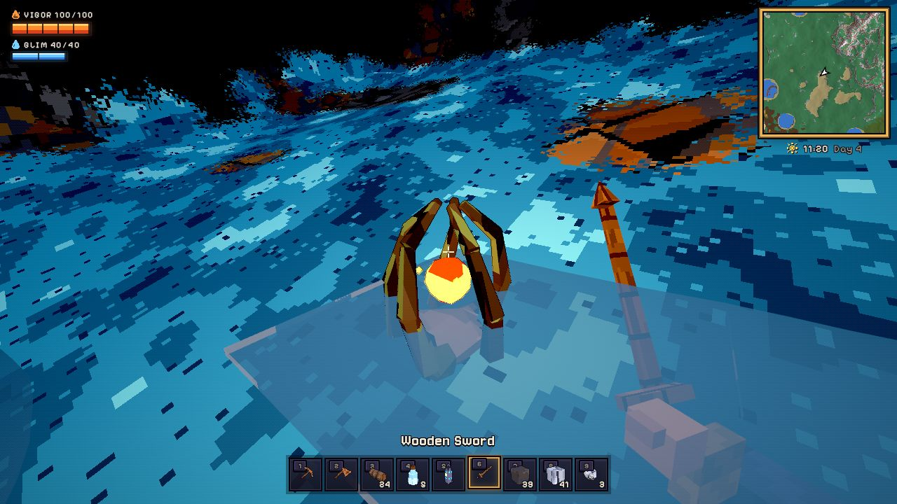

# Hollowdeep (working title)

An original 3D sandbox about digging down, building up and surviving the
night, with organic, destructible, **non-voxel** terrain and a stylized
low-poly / pixel-texture look. Hollowdeep has its own lands, creatures and
lore: the Rootwold's petrified arches, the titan bones of the Ossuary Flats,
glowing resin in the Amberwood, Starseeds drifting down on clear nights and
the green-skied Sporefall.

Engine: **TypeScript + Three.js + Vite** (runs in the browser).

## Run

```bash
npm install
npm run dev          # http://localhost:5173
npm test             # unit tests (world generation, meshing, editing)
npm run build        # typecheck + production build
npm run e2e          # headless-browser test of the full game loop (needs a build)
node scripts/e2e-mobile.mjs   # phone-sized touch smoke test (needs a build)
npx tsx scripts/biome-map.ts 1337   # top-down biome map + biome shares for a seed
node scripts/biome-shots.mjs        # a screenshot of every biome (needs a build)
node scripts/creature-shots.mjs     # close-up lineups of every creature (needs a build)
```

The game opens on a title screen over the live world. From there you can
**Continue** or **Play**, create a **New World** from a seed, change
**Settings** (graphics quality, field of view, look sensitivity, invert look,
volume, frame-rate counter, fullscreen; saved per browser) and view the
**Controls**. Press Esc in game to pause, save, or quit to the title.

URL options: `?seed=1234` (world seed), `?new` (start a fresh world),
`?play` (skip the title screen), `?quality=low|medium|high`, `?touch`
(force the touch controls). `node scripts/ui-shots.mjs` captures every
menu screen for review.

## Controls

| Input | Action |
|---|---|
| WASD / Mouse | Move / look |
| Shift · Space · C or Ctrl | Sprint · jump / swim up · crouch |
| LMB | Use held item (mine, chop, attack, place, drink) |
| RMB | Interact: doors, chests, beds, talk to NPCs |
| F | Grappling hook (equip a hook in an accessory slot) |
| Space (hold, in the air) | Fly with wings, then glide |
| H | Check whether the room you stand in is a valid home |
| 1–9, mouse wheel | Select hotbar slot |
| Q | Cycle build shape for the held material (terrain fill, floor, wall, pillar, stairs, roof) |
| Tab / E | Inventory and crafting |
| Esc | Pause menu (resume, settings, save, quit to title) |
| F5 / F9 | Save / reload the saved world |
| F3 | Debug readout (fps, triangles, draw calls, LOD) |

**Touch (phones and tablets):** left stick to move (push fully to sprint),
drag anywhere on the right to look, and on-screen buttons for use, jump,
crouch, interact, grapple, build shape and inventory. ☰ pauses and saves.
Touch devices start on the low quality preset.

## What is in the game

- **Mining and building:** every surface can be dug, filled and built on.
  Modular pieces (floors, walls, pillars, stairs, roofs) sit on a 2 m grid.
- **Crafting:** recipes by hand and at stations (workbench, Hearth, furnace,
  anvil, Lumite Forge). Copper and iron tool tiers gate harder rock.
  Draughts are brewed over a Hearth.
- **Hearth and home:** doors, torches, chairs, beds, chests and lamps. A
  home is an enclosed room with a door, a lit **Hearth** and somewhere to
  rest (a bed or chair). Settlers move in: Aldo the Lamplighter, Pell the
  Wayfarer (who trades for Amber) and, later, Wren the Clockwright.
- **Vigor and Glim:** your life is **Vigor**, an ember gauge; **Glim** is
  the stored light that powers staves. Both gauges lengthen as you grow.
- **Combat:** swords, mauls, bows, staves and bombs against Burrlings
  (hopping burr-pods), Rootwalkers, Drifters (sky jellyfish that come down at
  night), Duskwings, crawlers and the Hollowfolk. Enemies vary by biome and
  depth, and you respawn at your bed.
- **Growing stronger:** **Heartroots** (petrified roots caged round an ember
  core) grow on cave floors: break one and use it for +20 max Vigor (up to
  400). On clear nights **Starseeds** drift slowly down like dandelion seeds:
  catch them in the air or find where they land. Five, sealed in glass, make
  a **Glim Vessel** (+20 max Glim, up to 200).
- **Amber** is Hollowdeep's currency: dropped by creatures and dug out of the
  Amberwood's glowing resin.
- **Biomes:** crossing into a new land shows its name.
  - **Greenhollow:** the temperate forest around spawn.
  - **Sunscar Dunes** and **Frostmere:** sand seas and frozen peaks.
  - **The Riftlands:** slate-blue ground split by deep chasms, lit by cyan
    crystal growing on dead trees.
  - **The Rootwold:** deep olive moss under colossal **petrified root arches**
    and gnarled, moss-hung trees. Mossbacks (crawlers carrying a boulder of
    moss) and Moss Burrlings live here. Petrified Root makes the Bramble Maul,
    the Heartwood Longbow and Amber Lanterns.
  - **Ossuary Flats:** a dead salt pan with cracked crust, strewn with the
    half-sunk skeletons of titans (spines, ribcages, skulls and tusks).
    Bonepickers circle overhead and Saltback Crawlers pick at the crust.
    Titan Bone makes the fast Titanbone Pickaxe, and salt makes Salt Lamps
    and brews Mending Draughts.
  - **Amberwood:** an autumn forest of orange crowns over leaf litter, with
    glowing resin nodules and amber pockets underground. Amber Burrlings
    and Leafwings live here.
  - Underground are caves, cabins with loot chests, glowing lumite crystals,
    the molten Ember Depths and the **glowing mushroom caverns**. These are
    wide mud halls with luminous floors and giant blue mushrooms, home to
    Sporelings and Glowmoths. Fell the mushrooms for glowcaps, which brew
    Glim Draughts and make Glowcap Lamps.
- **Bosses:**
  - **The Deepwyrm:** carve a Tremor Totem at an anvil and drive it into
    the ground at night or underground. It is a segmented worm that tunnels through the real
    terrain and erupts out of the ground at you.
  - **The Tempest Roc:** use a Gale Idol high in the open sky. A giant storm
    bird that circles, fires volleys of feathers and dives at you. In its
    second phase it calls Gale Swifts and blasts gusts of wind. It drops Roc
    Wings (flight) and the Tempest Staff.
- **Events:**
  - **Sporefall:** any night after the first, the sky can turn a sickly
    green while glowing spores sift down. Spore Burrlings, Rotfangs
    (fungus-backed hounds), Sporebound and Spore Drifters walk, and drop
    Sporeglass for the Mycelheart Amulet and the vigor-drinking Sporecleaver.
  - **The Hollow March:** once the Deepwyrm is dead, the Hollowfolk may march
    on a town with two residents (or sound a Hollow War Horn). Raiders,
    bomb-lobbing Sappers and club-wielding Brutes attack until enough of
    them fall. Winning brings Wren the Clockwright, who sells accessories.
- **Sky tier:** the floating islands hold Aerite ore and are home to Gale
  Swifts and Cloud Burrlings. Aerite makes the Skyforged armor set (extra jump,
  speed, no fall damage and longer wing flight) and the two-arrow Gale Bow.
- **Water:** lakes sit in carved bowls with sandy shores, and pools lie in
  the caves. Water falls and spreads, and levels out in whatever you dig.
  Tunnels dug from the coast below sea level flood. You can swim anywhere
  (watch the breath bubbles), and buckets scoop water up and pour it out.
- **World:** 768 m across (saves from older versions keep their 512 m
  world) with sky islands, a day/night cycle, and distant terrain drawn at
  lower detail so the whole map is visible from a high point.

## How the world works (and why it is not voxels)

The terrain is a **signed density field** sampled once per metre (positive =
solid). The visible surface is extracted with **Surface Nets**, which gives
smooth, organic, faceted polygon meshes: hills, cliffs, overhangs, tunnels
and caverns. The sampling grid is internal only; nothing ever renders as a
cube.

- **Mining** is CSG subtraction of a sphere from the field. Removed volume
  per material turns into items. Only the affected chunks are re-meshed.
- **Physics** collides the player (a stack of spheres) against the same
  field via gradient-normalised distance, plus analytic SDFs for building
  pieces and tree trunks. There are no collision meshes.
- **Saves** store only what the player changed: a replayable log of CSG
  edits, placed pieces, felled trees, the inventory and the player's
  position. The world regenerates from the seed.
- **Building** uses modular pieces on a 2 m placement grid (a building aid,
  not the world representation). Terrain can also be filled back in with
  dirt, stone, sand and other materials.

See [`docs/ROADMAP.md`](docs/ROADMAP.md) for the architecture and the development plan.

## Layout

```
src/
  audio/      procedural sound effects
  core/       seeded noise + PRNG
  world/      config, materials, TerrainField (density + CSG), generator,
              Surface Nets mesher, worker pool, SkyMap, vegetation,
              world structures (cabins, depths), collision, persistence
  building/   modular pieces, furniture, housing check
  entities/   creatures, combat, NPCs and town, world events, bosses
              (the Deepwyrm, the Tempest Roc)
  items/      item database, recipes, inventory, equipment
  player/     controller, input, interaction, grappling hook, vitals
  render/     pixel-art textures, world shader, terrain streaming + LOD,
              vegetation, models (items, furniture, creatures, NPCs), icons,
              atmosphere, particles, post FX (outlines), viewmodel
  ui/         HUD, minimap, inventory/crafting, dialogue, quality presets,
              touch controls
tests/        vitest unit tests
scripts/      e2e browser tests (desktop and mobile)
```

## Screenshots (from the automated e2e run)

| Forest | Overview with sky island |
|---|---|
|  |  |
| **Cave chamber (lantern + lumite crystal)** | **Tunnel dug with the pickaxe** |
|  |  |
| **Far view (distant LOD)** | **An NPC moves into a valid house** |
|  |  |
| **Sunscar Dunes** | **Ember Depths** |
|  |  |
| **Crafting stations** | **The Deepwyrm** |
|  |  |
| **Sporefall** | **The Hollow March** |
|  |  |
| **The Tempest Roc** | **Gale Swifts over a sky island** |
|  |  |
| **Mushroom cavern** | **Heartroot** |
|  |  |
| **The Rootwold** | **Ossuary Flats** |
|  |  |
| **Amberwood** | **The Riftlands** |
|  |  |
| **Event creatures** | **Touch controls on a phone** |
|  |  |
