# Hollowdeep (working title)

An original sandbox in the spirit of Terraria, built as a fully 3D game with
organic, destructible, **non-voxel** terrain and a stylized low-poly /
pixel-texture look.

Engine: **TypeScript + Three.js + Vite** (runs in the browser).

## Run

```bash
npm install
npm run dev          # http://localhost:5173
npm test             # unit tests (world generation, meshing, editing)
npm run build        # typecheck + production build
npm run e2e          # headless-browser test of the full game loop (needs a build)
node scripts/e2e-mobile.mjs   # phone-sized touch smoke test (needs a build)
```

URL options: `?seed=1234` (world seed), `?new` (ignore the save),
`?continue=1` (load the save), `?quality=low|medium|high`, `?touch` (force
the touch controls).

## Controls

| Input | Action |
|---|---|
| WASD / Mouse | Move / look |
| Shift · Space · C or Ctrl | Sprint · jump / swim up · crouch |
| LMB | Use held item (mine, chop, attack, place, drink) |
| RMB | Interact: doors, chests, beds, talk to NPCs |
| F | Grappling hook (equip a hook in an accessory slot) |
| Space (hold, in the air) | Fly with wings, then glide |
| H | Check whether the room you stand in is valid housing |
| 1–9, mouse wheel | Select hotbar slot |
| Q | Cycle build shape for the held material (terrain fill, floor, wall, pillar, stairs, roof) |
| Tab / E | Inventory and crafting |
| F5 / F9 | Save / reload the saved world |
| F3 | Debug readout (fps, triangles, draw calls, LOD) |

**Touch (phones and tablets):** left stick to move (push fully to sprint),
drag anywhere on the right to look, and on-screen buttons for use, jump,
crouch, interact, grapple, build shape and inventory. ☰ pauses and saves.
Touch devices start on the low quality preset.

## What is in the game

- **Mining and building:** every surface can be dug, filled and built on.
  Modular pieces (floors, walls, pillars, stairs, roofs) sit on a 2 m grid.
- **Crafting:** recipes by hand and at stations (workbench, furnace, anvil,
  and more). Copper and iron tool tiers gate harder rock.
- **Furniture and housing:** doors, torches, chairs, tables, beds and chests.
  An enclosed room with a door, light, seat and table is valid housing, and
  townsfolk move in: Aldo the Surveyor and Pell the Merchant (who runs a shop).
- **Combat:** swords, bows, bombs and potions against globs, bats, wisps,
  crawlers, shamblers and miners. Enemies vary by biome and depth. You have
  hearts and mana stars, and you respawn at your bed.
- **Growing stronger:** Life Crystals glow on cave floors. Break one and use
  it for +20 max life (up to 400). Stars fall on clear nights; five make a
  Mana Crystal (+20 max mana, up to 200), and they also brew mana potions.
- **Biomes:** forest, desert, snow and the purple Blight on the surface.
  Underground are caves, cabins with loot chests, glowing lumite crystals
  and the molten Ember Depths.
- **Bosses:**
  - **The Deepwyrm:** craft Wyrm Bait at an anvil and use it at night or
    underground. It is a segmented worm that tunnels through the real
    terrain and erupts out of the ground at you.
  - **The Tempest Roc:** use a Gale Idol high in the open sky. A giant storm
    bird that circles, fires volleys of feathers and dives at you. In its
    second phase it calls Gale Swifts and blasts gusts of wind. It drops Roc
    Wings (flight) and the Tempest Staff.
- **Events:**
  - **Blood Moon:** any night after the first can turn red. Blood Globs,
    Gorehounds, Vein Shamblers and Bloodwisps come out and drop Sanguine
    Shards for the Heartstone Amulet and the lifestealing Sanguine Blade.
  - **The Hollow Raid:** once the Deepwyrm is dead, the Hollowfolk may march
    on a town with two residents (or sound a Hollow War Horn). Raiders,
    bomb-lobbing Sappers and club-wielding Brutes attack until enough of
    them fall. Winning brings Wren the Tinkerer, who sells accessories.
- **Sky tier:** the floating islands hold Aerite ore and are home to Gale
  Swifts and Cloud Globs. Aerite makes the Skyforged armor set (extra jump,
  speed, no fall damage and longer wing flight) and the two-arrow Gale Bow.
- **World:** 512 m across with sky islands, a day/night cycle, and distant
  terrain drawn at lower detail so the whole map is visible from a high
  point.

## How the world works (and why it is not voxels)

The terrain is a **signed density field** sampled once per metre (positive =
solid). The visible surface is extracted with **Surface Nets**, which gives
smooth, organic, faceted polygon meshes: hills, cliffs, overhangs, tunnels
and caverns. The sampling grid is internal only; nothing ever renders as a
cube.

- **Mining** is CSG subtraction of a sphere from the field. Removed volume
  per material turns into items. Only the affected chunks are re-meshed.
- **Physics** collides the player (a stack of spheres) against the same
  field via gradient-normalised distance, plus analytic SDFs for building
  pieces and tree trunks. There are no collision meshes.
- **Saves** store only what the player changed: a replayable log of CSG
  edits, placed pieces, felled trees, the inventory and the player's
  position. The world regenerates from the seed.
- **Building** uses modular pieces on a 2 m placement grid (a building aid,
  not the world representation). Terrain can also be filled back in with
  dirt, stone, sand and other materials.

See [`docs/ROADMAP.md`](docs/ROADMAP.md) for the architecture and the development plan.

## Layout

```
src/
  audio/      procedural sound effects
  core/       seeded noise + PRNG
  world/      config, materials, TerrainField (density + CSG), generator,
              Surface Nets mesher, worker pool, SkyMap, vegetation,
              world structures (cabins, depths), collision, persistence
  building/   modular pieces, furniture, housing check
  entities/   creatures, combat, NPCs and town, world events, bosses
              (the Deepwyrm, the Tempest Roc)
  items/      item database, recipes, inventory, equipment
  player/     controller, input, interaction, grappling hook, vitals
  render/     pixel-art textures, world shader, terrain streaming + LOD,
              vegetation, models (items, furniture, creatures, NPCs), icons,
              atmosphere, particles, post FX (outlines), viewmodel
  ui/         HUD, minimap, inventory/crafting, dialogue, quality presets,
              touch controls
tests/        vitest unit tests
scripts/      e2e browser tests (desktop and mobile)
```

## Screenshots (from the automated e2e run)

| Forest | Overview with sky island |
|---|---|
| 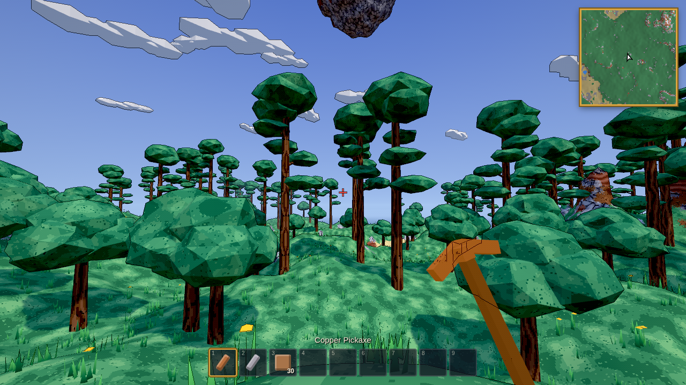 | 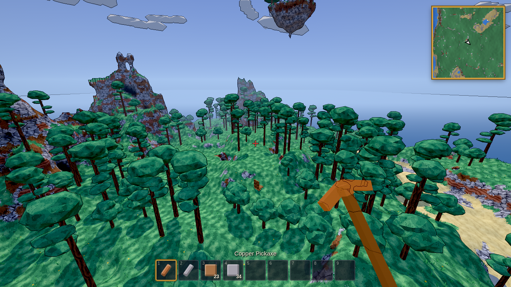 |
| **Cave chamber (lantern + lumite crystal)** | **Tunnel dug with the pickaxe** |
| 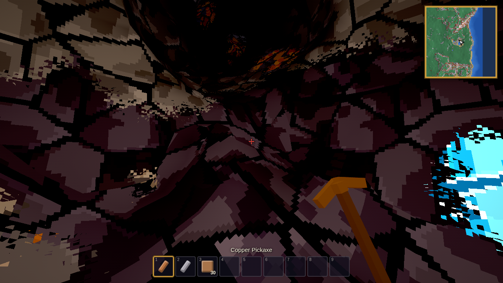 | 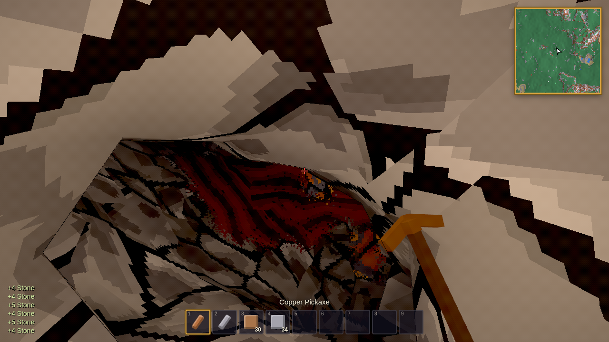 |
| **Far view (distant LOD)** | **An NPC moves into a valid house** |
| 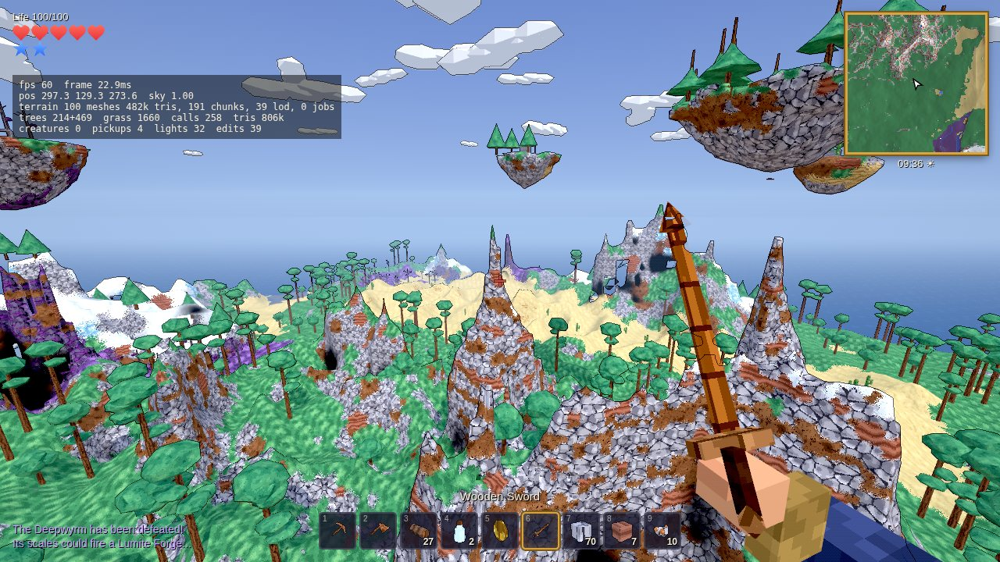 | 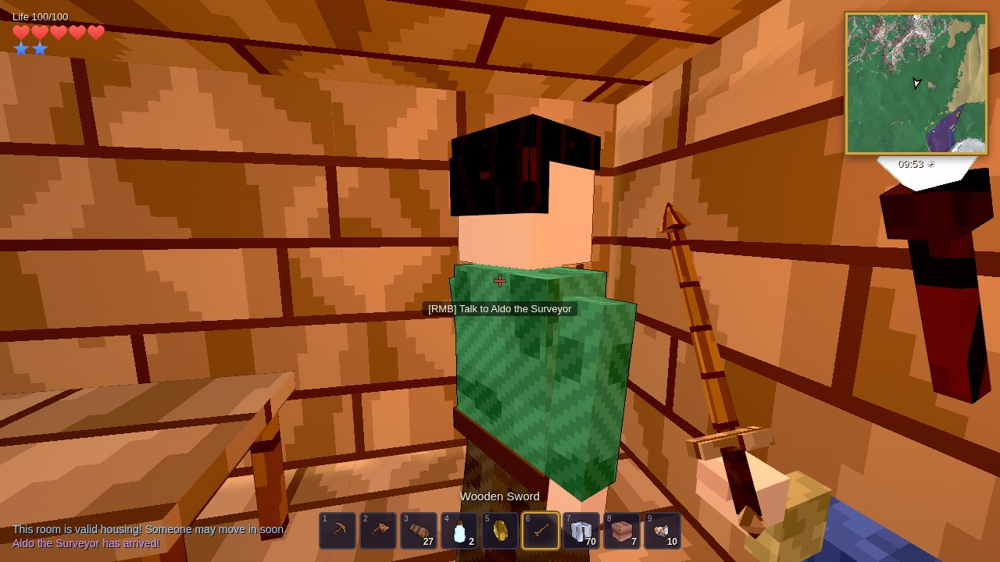 |
| **Desert** | **Ember Depths** |
| 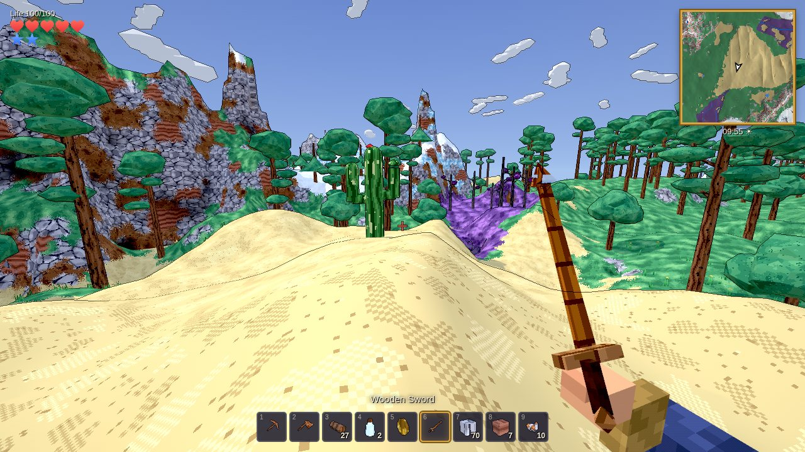 | 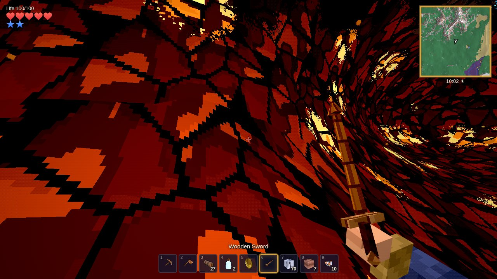 |
| **Crafting stations** | **The Deepwyrm** |
| 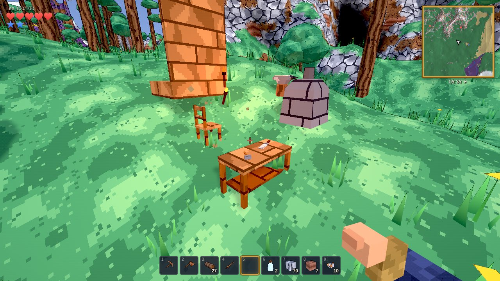 | 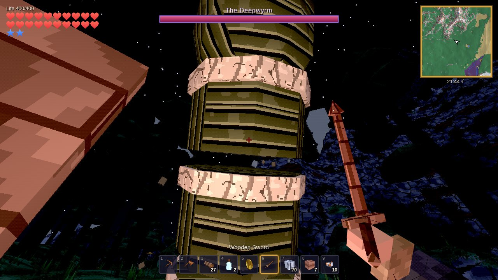 |
| **Blood Moon** | **The Hollow Raid** |
| 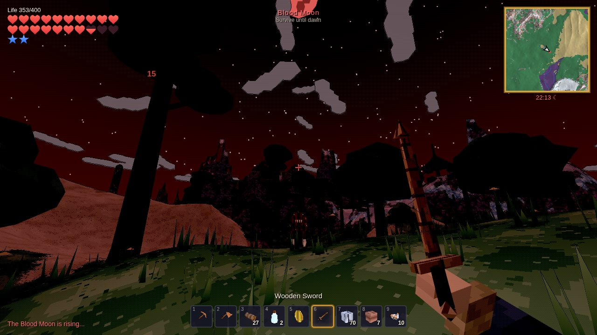 | 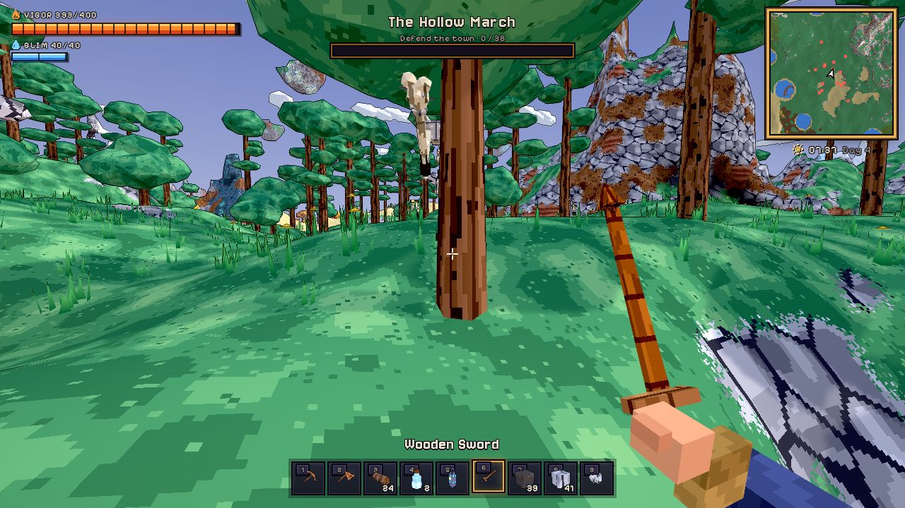 |
| **The Tempest Roc** | **Gale Swifts over a sky island** |
| 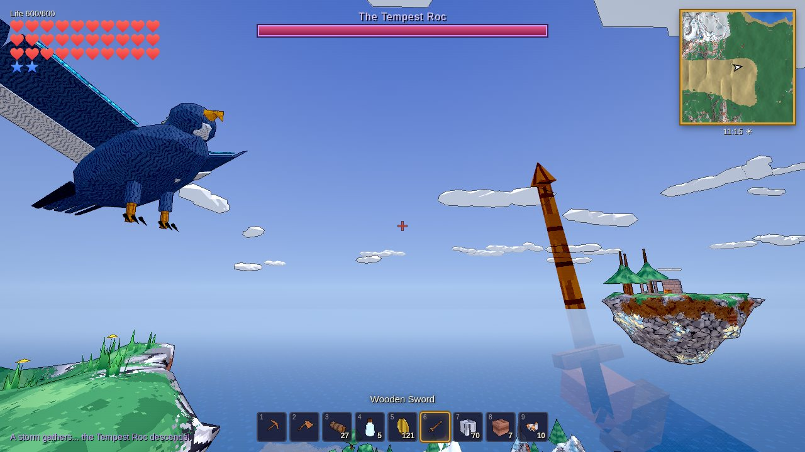 | 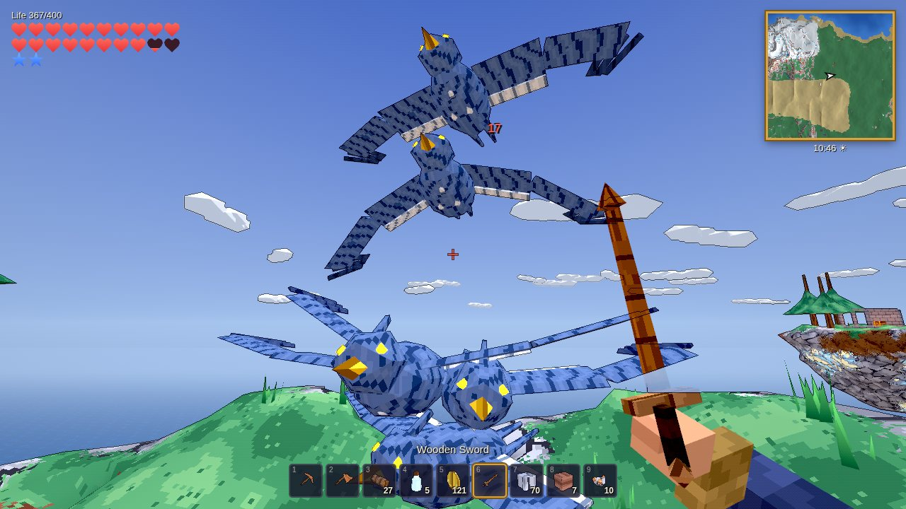 |
| **Event creatures** | **Touch controls on a phone** |
| 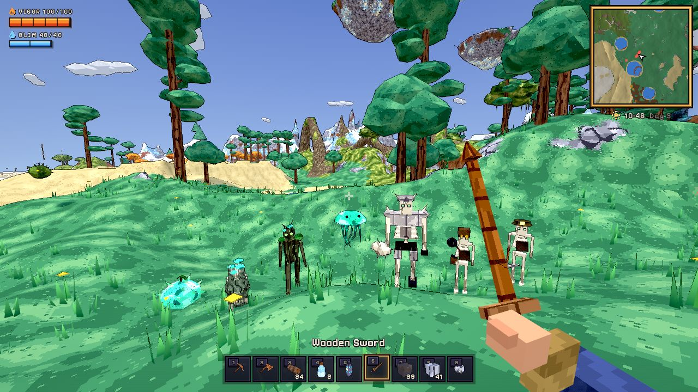 | 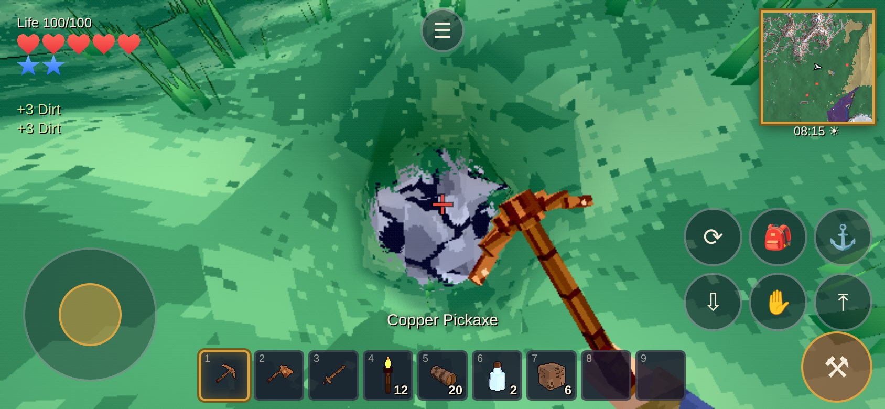 |
