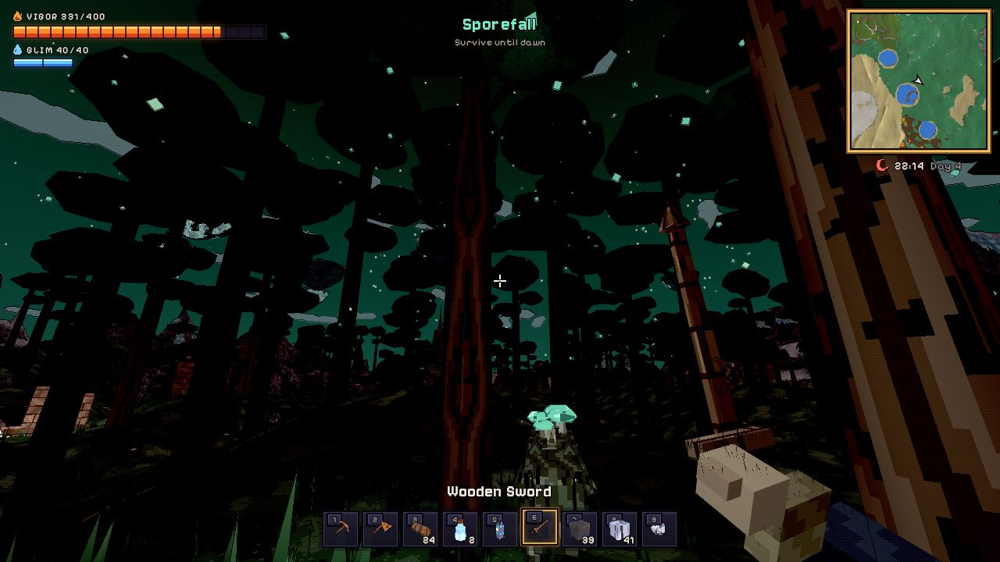
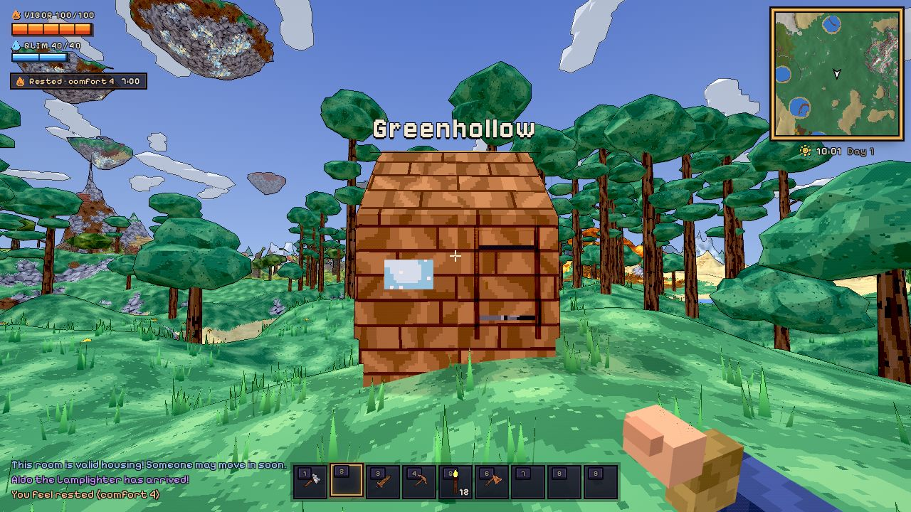
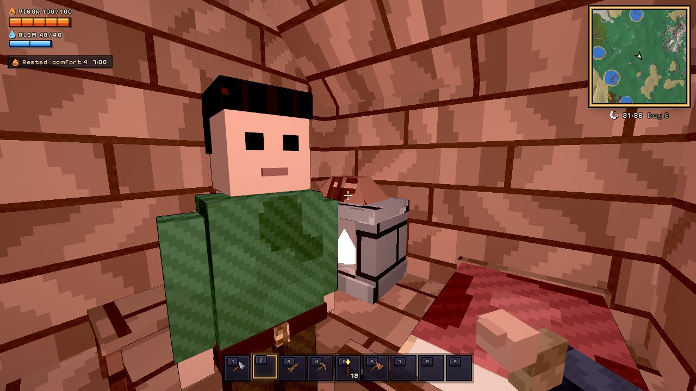
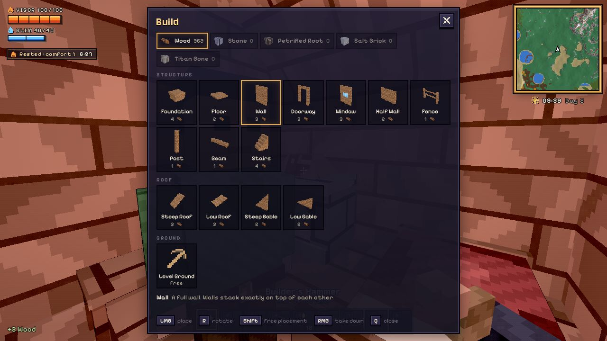
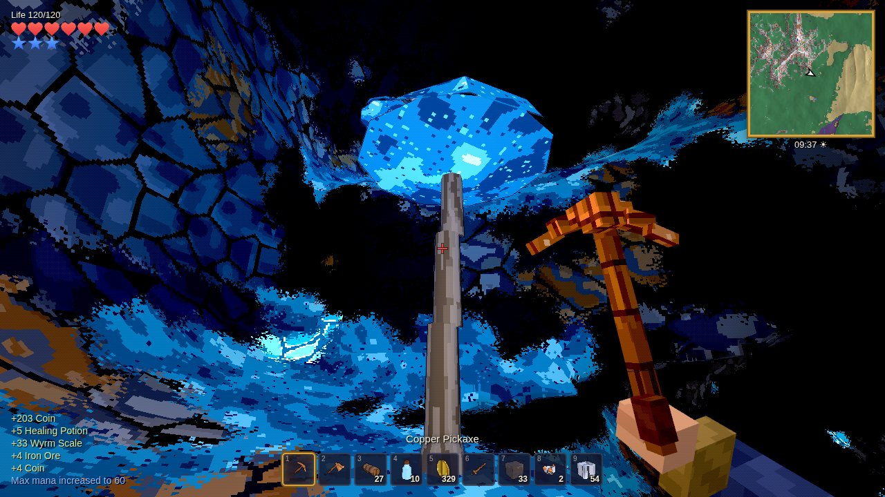
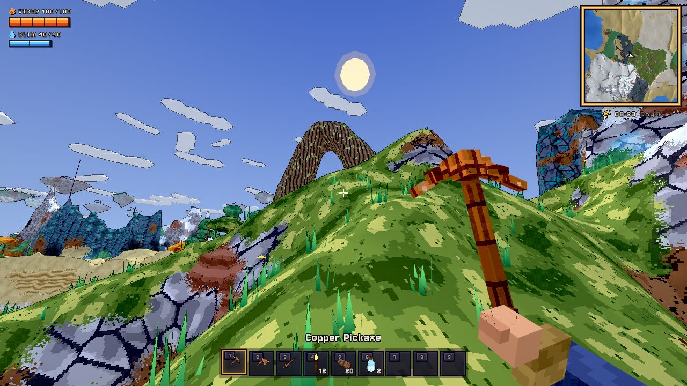
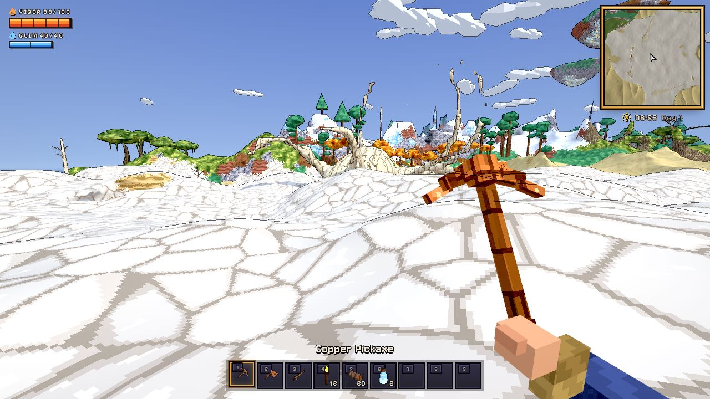
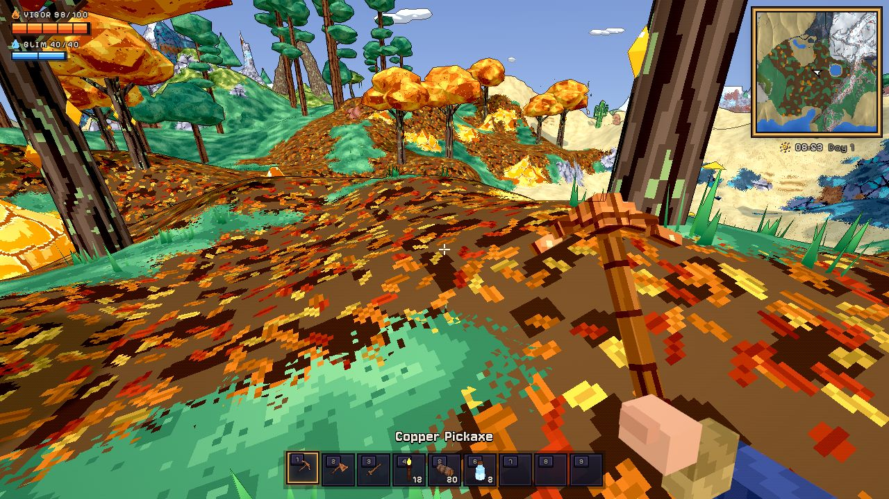
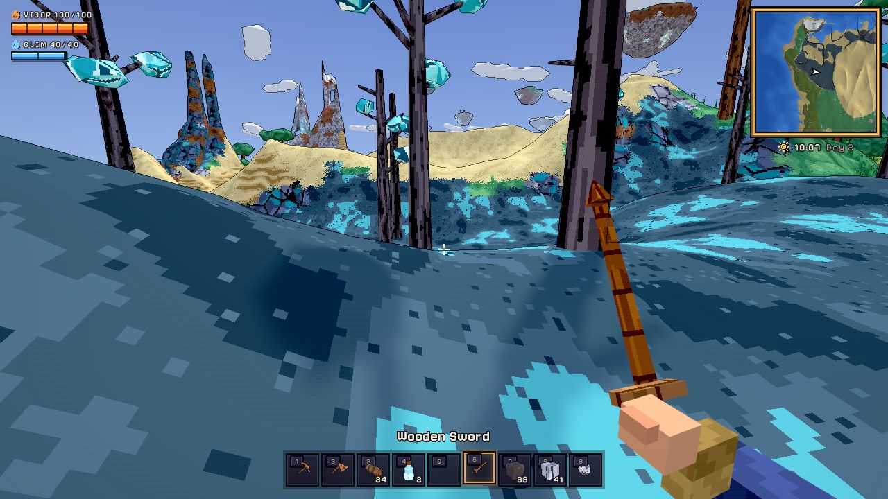

# Hollowdeep (working title)

An original 3D sandbox about digging down, building up and surviving the
night, with organic, destructible, **non-voxel** terrain and a stylized
low-poly / pixel-texture look. Hollowdeep has its own lands, creatures and
lore: the Rootwold's petrified arches, the titan bones of the Ossuary Flats,
glowing resin in the Amberwood, the smoking volcanoes of the Cinder Peaks,
Starseeds drifting down on clear nights, the green-skied Sporefall and the
Cinderbound, fire cultists who come down from the mountains for your Hearth.

Engine: **TypeScript + Three.js + Vite** (runs in the browser).

## Run

```bash
npm install
npm run dev          # http://localhost:5173
npm test             # unit tests (world generation, meshing, editing)
npm run build        # typecheck + production build
npm run e2e          # headless-browser test of the full game loop (needs a build)
npm run e2e:build    # builds a two-room house with the hammer like a player would (needs a build)
node scripts/e2e-mobile.mjs   # phone-sized touch smoke test (needs a build)
npx tsx scripts/biome-map.ts 1337   # top-down biome map + biome shares for a seed
node scripts/biome-shots.mjs        # a screenshot of every biome (needs a build)
node scripts/creature-shots.mjs     # close-up lineups of every creature (needs a build)
```

The game opens on a title screen over the live world. From there you can
**Continue** or **Play**, create a **New World** from a seed, change
**Settings** (graphics quality, field of view, look sensitivity, invert look,
volume, frame-rate counter, fullscreen; saved per browser) and view the
**Controls**. Press Esc in game to pause, save, or quit to the title.

URL options: `?seed=1234` (world seed), `?new` (start a fresh world),
`?play` (skip the title screen), `?quality=low|medium|high`, `?touch`
(force the touch controls). `node scripts/ui-shots.mjs` captures every
menu screen for review.

## Controls

| Input | Action |
|---|---|
| WASD / Mouse | Move / look |
| Shift · Space · C or Ctrl | Sprint · jump / swim up · crouch |
| LMB | Use held item (mine, chop, attack, place, drink) |
| RMB | Interact: doors, chests, beds, talk to the merchant |
| F | Grappling hook (equip a hook in an accessory slot) |
| Space (hold, in the air) | Fly with wings, then glide |
| 1–9, mouse wheel | Select hotbar slot |
| Q | With the Builder's Hammer: open the build menu (pieces and material) |
| R · hold Shift | Rotate / flip the piece · place without snapping to other pieces |
| RMB with the hammer | Take a piece down (full refund) |
| Tab / E | Inventory and crafting |
| Esc | Pause menu (resume, settings, save, quit to title) |
| F5 / F9 | Save / reload the saved world |
| F3 | Debug readout (fps, triangles, draw calls, LOD) |

**Touch (phones and tablets):** left stick to move (push fully to sprint),
drag anywhere on the right to look, and on-screen buttons for use, jump,
crouch, interact, grapple, build shape and inventory. ☰ pauses and saves.
Touch devices start on the low quality preset.

## What is in the game

- **Mining and building:** every surface can be dug and filled (hold stone,
  dirt or sand to fill terrain), and bases are built with the **Builder's
  Hammer** (in your starting kit, or craft it from 8 wood and 4 stone):
  - **Build menu** ([Q] or the build button on touch): foundations, floors,
    walls, doorways, glazed windows, half walls, fences, posts, beams,
    stairs, steep and low roofs, gables, plus a **Level Ground** tool that
    flattens terrain to your feet. Build in wood, stone, Petrified Root,
    salt brick or Titan Bone.
  - **Snapping to what you've built:** walls stand on floor tops and stack
    exactly on other walls (aim anywhere on the wall), floors lie level with
    their neighbours or rest on wall tops for an upper storey, and roof
    panels sit on wall tops and continue each other's slope. Hold Shift to
    place freely; [R] rotates or flips (gables, stairs, roofs).
  - **Foundations** stay level on a hillside: their footing reaches down into
    the ground automatically.
  - **Support:** a piece must touch the ground or another piece.
  - **Doors** (a Wooden Door from the workbench) drop straight into
    doorways, open and close with RMB, swing away from you, and keep
    creatures out while shut. Window panes are see-through. Aim the hammer
    at a piece and press RMB to take it down for a full refund.
  - **Resting:** stand under a roof near a lit Hearth to become **Rested**
    (faster health and mana regeneration). Beds, chairs, tables, chests and
    lamps nearby raise the room's comfort, and higher comfort makes the rest
    last longer.
- **Crafting:** recipes by hand and at stations (workbench, Hearth, furnace,
  anvil, Lumite Forge). Copper and iron tool tiers gate harder rock.
  **Red Elixirs** (health) and **Blue Elixirs** (mana) are brewed over a
  Hearth.
- **No settlers, no housing checks:** your base is wherever your Hearth is.
  Doors, torches, chairs, beds, chests and lamps make it comfortable, and
  nothing spawns within the glow of a lit Hearth (or by a bed or door).
- **Nights** bring more and fiercer creatures than the day, but at a steady
  trickle rather than a flood, so there is still time to dig and build.
- **The wandering merchant:** every two or three days, at dawn, Pell the
  Wandering Merchant arrives with a pack cart and camps near your spawn
  point (your bed). He always carries torches and Red Elixirs, plus a
  handful of goods drawn from a pool that grows as you beat bosses and the
  Cinder Siege, and he moves on at dusk. Talk to him for tips.
- **Health and mana:** both bars grow as you use Red and Blue Essence.
- **Combat:** swords, mauls, bows, staves and bombs against Blobs (wobbling
  jelly with eye stalks, in a colour for every biome), Rootwalkers, Drifters
  (sky jellyfish that come down at night), Duskwings, crawlers and the
  Cinderbound. Enemies vary by biome and depth, and you respawn at your bed.
- **Growing stronger:** red crystals grow on cave floors: break one for
  **Red Essence** (+20 max health, up to 400). On clear nights **Starseeds**
  drift slowly down like dandelion seeds: catch them in the air or find where
  they land. Five condense into **Blue Essence** (+20 max mana, up to 200).
- **Amber** is Hollowdeep's currency: dropped by creatures and dug out of the
  Amberwood's glowing resin.
- **Biomes:** crossing into a new land shows its name.
  - **Greenhollow:** the temperate forest around spawn.
  - **Sunscar Dunes** and **Frostmere:** sand seas and frozen peaks. In the
    dunes, watch for trails of stirring sand: **Dune Worms** swim beneath
    it, circle under you, then burst out in a long arc with their mandibles
    wide and dive back in. Strike any part of the body.
  - **The Riftlands:** slate-blue ground split by deep chasms, lit by cyan
    crystal growing on dead trees.
  - **The Rootwold:** deep olive moss under colossal **petrified root arches**
    and gnarled, moss-hung trees. Mossbacks (crawlers carrying a boulder of
    moss) and Moss Blobs live here. Petrified Root makes the Bramble Maul,
    the Heartwood Longbow and Amber Lanterns.
  - **Ossuary Flats:** a dead salt pan with cracked crust, strewn with the
    half-sunk skeletons of titans (spines, ribcages, skulls and tusks).
    Bonepickers circle overhead and Saltback Crawlers pick at the crust.
    Titan Bone makes the fast Titanbone Pickaxe, and salt makes Salt Lamps
    and brews Red Elixirs.
  - **Amberwood:** an autumn forest of orange crowns over leaf litter, with
    glowing resin nodules and amber pockets underground. Amber Blobs
    and Leafwings live here.
  - **The Cinder Peaks:** smoking volcanoes on ash slopes among charred
    trees. Climb to the crater rim to look down on a lava lake; a lava tube
    runs from the flank to a glowing magma chamber inside. Basalt, obsidian
    and magma rock, Ash Blobs, and Cinder Scouts who throw burning rocks.
  - **Caves:** wide, winding tunnels that swell into big caverns a dozen
    metres down and into long, flat-floored halls deeper still. Dozens of
    **cave mouths** (sloping tunnels from a broad opening) and **sinkholes**
    (open shafts) lead down into them from the surface. Worlds made before
    this keep their original caves.
  - Underground are also cabins with loot chests, glowing lumite crystals,
    the molten Ember Depths and the **glowing mushroom caverns**. These are
    wide mud halls with luminous green floors and giant glowing mushrooms, home to
    Sporelings and Glowmoths. Fell the mushrooms for glowcaps, which brew
    Blue Elixirs and make Glowcap Lamps.
- **Bosses:**
  - **The Deepwyrm:** carve a Tremor Totem at an anvil and drive it into
    the ground at night or underground. It is a segmented worm that tunnels through the real
    terrain and erupts out of the ground at you.
  - **The Tempest Roc:** use a Gale Idol high in the open sky. A giant storm
    bird that circles, fires volleys of feathers and dives at you. In its
    second phase it calls Gale Swifts and blasts gusts of wind. It drops Roc
    Wings (flight) and the Tempest Staff.
- **Events:**
  - **Sporefall:** any night after the first, the sky can turn a sickly
    green while glowing spores sift down. Spore Blobs, Rotfangs
    (fungus-backed hounds), Sporebound and Spore Drifters walk, and drop
    Sporeglass for the Mycelheart Amulet and the life-drinking Sporecleaver.
  - **The Cinder Siege:** once the Deepwyrm is dead, the **Cinderbound**
    (a fire cult in basalt plate and ash robes, with ember eyes under their
    hoods) may come down from the mountains at dawn for your fire, or you can
    call them by sounding an Ember Horn by your Hearth. Cinderbound Raiders,
    bomb-throwing Firebrands and huge Basalt Colossi march on your Hearth
    until enough of them fall. Winning makes the merchant bring rarer goods.
    Deep underground, Ashdelvers of the same cult dig for embers.
- **Sky tier:** the floating islands hold Aerite ore and are home to Gale
  Swifts and Cloud Blobs. Aerite makes the Skyforged armor set (extra jump,
  speed, no fall damage and longer wing flight) and the two-arrow Gale Bow.
- **Water:** lakes sit in carved bowls with sandy shores, and pools lie in
  the caves. Water falls and spreads, and levels out in whatever you dig;
  its surface meets the shore along the ground's own contour.
  Tunnels dug from the coast below sea level flood. You can swim anywhere
  (watch the breath bubbles), and buckets scoop water up and pour it out.
  Creatures swim too, and scramble up the bank to get out.
- **Lava:** fills volcano craters, magma chambers and pools in the Ember
  Depths. It flows like water but slower and thicker, stopping in lumpy
  tongues, glows, and burns you (and most creatures) badly while slowing you
  down; a full set of Ember armor makes you immune. Where lava meets water,
  both turn into **obsidian**.
- **World:** 768 m across (saves from older versions keep their 512 m
  world) with sky islands, a day/night cycle, and distant terrain drawn at
  lower detail so the whole map is visible from a high point.

## How the world works (and why it is not voxels)

The terrain is a **signed density field** sampled once per metre (positive =
solid). The visible surface is extracted with **Surface Nets**, which gives
smooth, organic, faceted polygon meshes: hills, cliffs, overhangs, tunnels
and caverns. The sampling grid is internal only; nothing ever renders as a
cube.

- **Mining** is CSG subtraction of a sphere from the field. Removed volume
  per material turns into items. Only the affected chunks are re-meshed.
- **Physics** collides the player (a stack of spheres) against the same
  field via gradient-normalised distance, plus analytic SDFs for building
  pieces and tree trunks. There are no collision meshes.
- **Saves** store only what the player changed: a replayable log of CSG
  edits, placed pieces, felled trees, the inventory and the player's
  position. The world regenerates from the seed.
- **Building** uses modular pieces on a 2 m placement grid (a building aid,
  not the world representation). Terrain can also be filled back in with
  dirt, stone, sand and other materials.

See [`docs/ROADMAP.md`](docs/ROADMAP.md) for the architecture and the development plan.

## Layout

```
src/
  audio/      procedural sound effects
  core/       seeded noise + PRNG
  world/      config, materials, TerrainField (density + CSG), generator,
              Surface Nets mesher, worker pool, SkyMap, vegetation,
              world structures (cabins, depths), collision, persistence
  building/   modular pieces, furniture, Hearth comfort
  entities/   creatures, combat, the wandering merchant, world events, bosses
              (the Deepwyrm, the Tempest Roc)
  items/      item database, recipes, inventory, equipment
  player/     controller, input, interaction, grappling hook, vitals
  render/     pixel-art textures, world shader, terrain streaming + LOD,
              vegetation, models (items, furniture, creatures, NPCs), icons,
              atmosphere, particles, post FX (outlines), viewmodel
  ui/         HUD, minimap, inventory/crafting, dialogue, quality presets,
              touch controls
tests/        vitest unit tests
scripts/      e2e browser tests (desktop and mobile)
```

## Screenshots (from the automated e2e run)

| Forest | Overview with sky island |
|---|---|
|  |  |
| **Cave chamber (lantern + lumite crystal)** | **Tunnel dug with the pickaxe** |
|  |  |
| **Far view (distant LOD)** | **The wandering merchant's camp** |
|  |  |
| **Sunscar Dunes** | **Ember Depths** |
|  |  |
| **Crafting stations** | **The Deepwyrm** |
|  |  |
| **Sporefall** | **The Cinder Siege** |
|  |  |
| **The Tempest Roc** | **Gale Swifts over a sky island** |
|  |  |
| **A house built with the hammer** | **Inside: Hearth, bed and chair** |
|  |  |
| **The build menu** | **Mushroom cavern** |
|  |  |
| **Red crystal (Red Essence)** | **A volcano crater in the Cinder Peaks** |
|  |  |
| **Inside the magma chamber** | **The Cinder Peaks** |
|  |  |
| **The Rootwold** | **Ossuary Flats** |
|  |  |
| **Amberwood** | **The Riftlands** |
|  |  |
| **Event creatures** | **Touch controls on a phone** |
|  |  |
